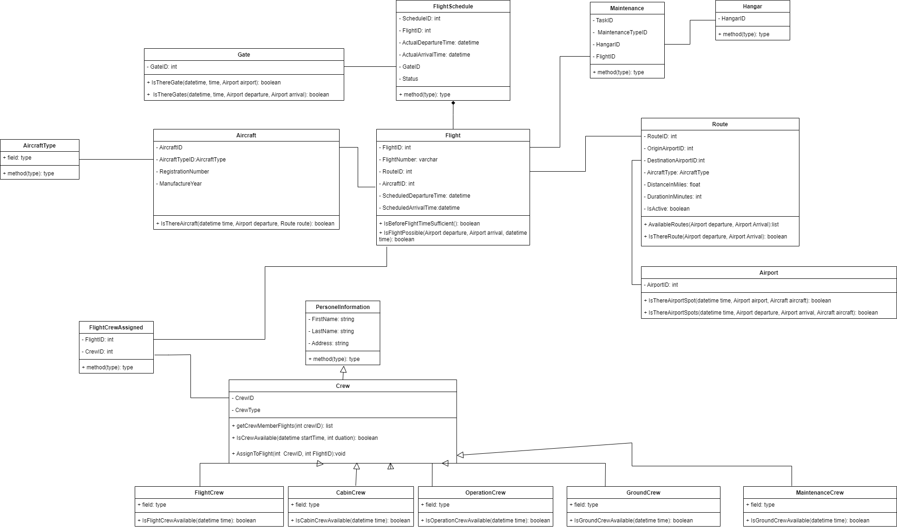

# Airline Flight Scheduling System

## Introduction

The Airline Flight Scheduling System is a software project designed to manage flight scheduling operations for an airline. This system helps streamline various aspects of airline operations, including flight planning, crew management, aircraft allocation, and more.

## Features

- **Flight Management**: Create, update, and delete flight schedules, including details such as flight number, route, aircraft type, departure/arrival times, and more.

- **Route Management**: Define and maintain routes between airports, including distance calculations and duration estimates.

- **Aircraft Management**: Manage the fleet of aircraft, including their availability, capacity, and range.

- **Airport Management**: Maintain airport information, including location and airport codes.

- **Crew Management**: Manage different types of crews, including flight crew, cabin crew, maintenance crew, and ground crew.

- **Maintenance Task Management**: Define and schedule maintenance tasks for aircraft in specific hangars.

- **Flight Crew Qualifications**: Track qualifications and certifications of flight crew members to ensure they are eligible for specific flights.

- **Availability Checks**: Perform availability checks to determine if a flight is possible based on criteria such as crew availability, aircraft availability, and time constraints.

